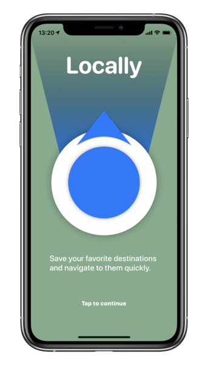
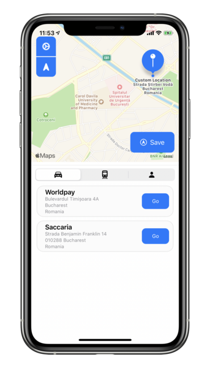
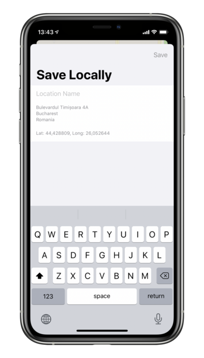
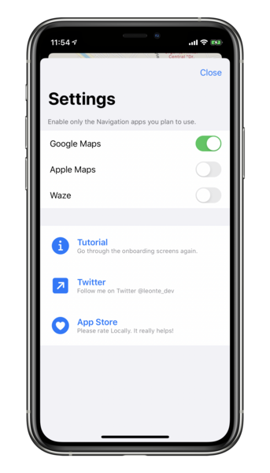

# Locally - Navigation Companion
**Your Locations Agenda**

**Locally is your private, favorite locations repo. Quickly jump into your preferred navigation app, with your choice of transit type.**

   

Technologies used: 
- SwiftUI
- MapKit & CoreLocation
- CoreData
- CloudKit